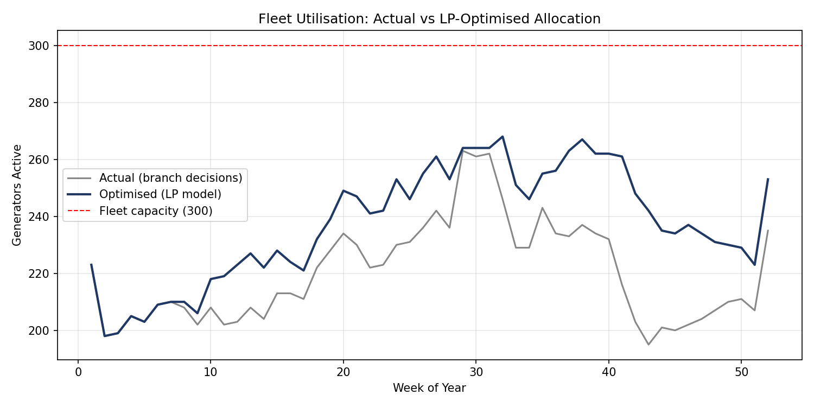
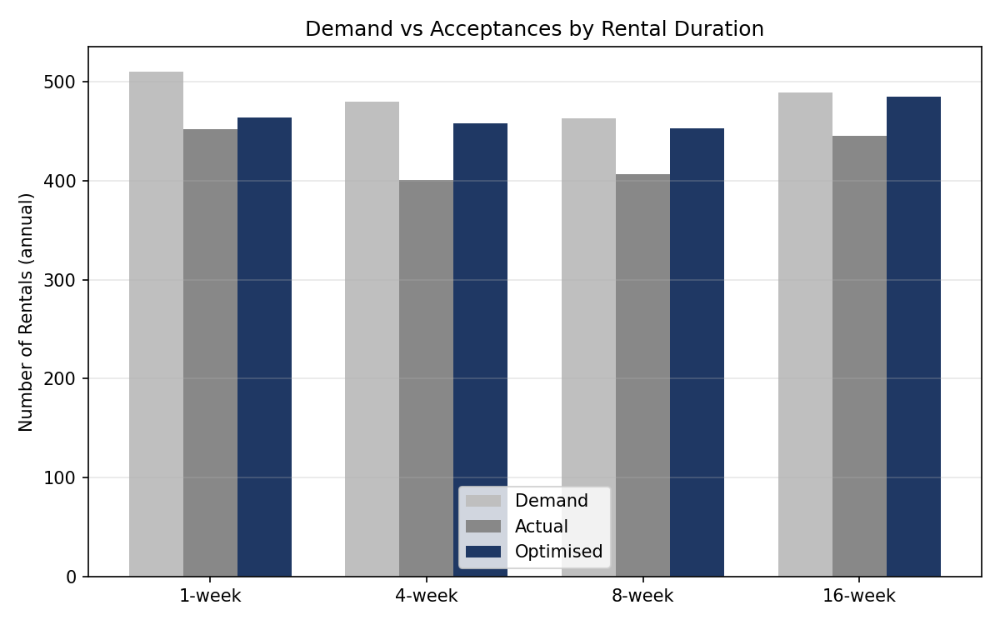

# Generator Fleet Revenue Management

A linear programming model that optimises capacity allocation for a fixed rental
fleet, achieving a **10% revenue uplift (+£466k)** with no price changes — purely
through smarter acceptance decisions.

## The problem

A generator rental company operates a fixed fleet of 300 units across four rental
durations (1, 4, 8, and 16 weeks), each priced differently (longer rentals = lower
daily rate). Because a 16-week booking ties up a generator for four months, every
acceptance decision has an opportunity cost — accept a long, low-margin booking
today and you may have to turn away several profitable short-term customers later
in the year. The business had been making these accept/reject decisions on
intuition (roughly balancing the mix ~25% per duration), leaving demand
unmet in 39 of 52 weeks despite idle fleet capacity.

## Approach

This is a network revenue management problem, structurally similar to airline
seat inventory control — but with one added complexity: unlike a flight seat,
which is either sold or lost forever, a generator is **recovered and re-rentable**
once its rental period ends. That recovery dynamic has to be modelled explicitly
via a rolling capacity constraint.

**Model formulation:**
- **Decision variables:** `x[t,d]` — number of generators accepted in week `t`
  for duration `d ∈ {1, 4, 8, 16}` weeks
- **Objective:** maximise total revenue across all weeks and durations
- **Constraints:**
  - Demand cap — can't accept more than actual customer demand in any
    week/duration
  - Rolling capacity — total generators active in week `t` (including
    overlapping rentals accepted in prior weeks) can't exceed available fleet
    capacity, which itself evolves based on exogenous returns from
    pre-existing rentals

Implemented in Python with [Pyomo](https://www.pyomo.org/) and solved with the
open-source [GLPK](https://www.gnu.org/software/glpk/) solver.

## Results

| Metric | Actual | Optimised | Improvement |
|---|---|---|---|
| Total Revenue | £4,650,479 | £5,116,909 | **+10.03% (+£466,430)** |
| Load Factor | 73.4% | 79.1% | +5.7 pts |
| ROI (revenue/fleet ÷ unit cost) | 5.17 | 5.69 | +0.52 |

The gain comes entirely from **reallocation, not price changes** — the model
accepts more of every rental duration, not just the highest-margin one:

| Duration | Demand | Actual | Optimised |
|---|---|---|---|
| 1-week | 510 | 452 | 464 |
| 4-week | 480 | 401 | 458 |
| 8-week | 463 | 407 | 453 |
| 16-week | 489 | 445 | 485 |





## Practical takeaway: bid pricing

The LP's shadow prices on the weekly capacity constraint are directly usable as
**bid-price thresholds** — a branch manager can accept a rental request only if
its revenue contribution clears that week's bid price, without needing to
re-run the full optimisation for every decision. This turns a batch,
full-horizon model into an operationally usable weekly decision rule.

## Limitations

- The model assumes perfect knowledge of prices and demand across the full
  52-week horizon, which isn't realistic — in practice, decisions are made
  sequentially with incomplete information. This makes the 10% figure an
  upper bound, not a guaranteed outcome.
- Continuous relaxation allows fractional acceptances; real generators are
  indivisible, so the true achievable uplift is somewhat lower.
- The dataset likely understates true peak demand due to demand censoring
  (unrecorded requests during periods when capacity was already full).

**Natural next steps:** a dynamic programming formulation (solved backwards via
Bellman's equation) would produce a policy resilient to demand uncertainty
rather than a single fixed-horizon plan, and a cost-based overbooking policy
using historical cancellation rates could recover additional revenue currently
lost to excess caution.

## Repo structure

```
├── data/
│   └── generator_rental_data.xlsx   # 52-week price/demand/acceptance/returns data
├── src/
│   └── model.py                     # LP model: build, solve, report results
├── results/
│   ├── fleet_utilisation.png
│   └── demand_vs_acceptances.png
└── requirements.txt
```

## Running it

```bash
pip install -r requirements.txt

# GLPK solver (Debian/Ubuntu)
sudo apt-get install glpk-utils

python src/model.py
```

## Tech stack

Python · Pyomo · GLPK · pandas · NumPy

---
*Originally built as a group project for the Pricing Analytics module of my
MSc Business Analytics at Warwick Business School. This repo contains the
model I contributed to and have since cleaned up for public sharing — course
identifiers and group member details have been removed.*
